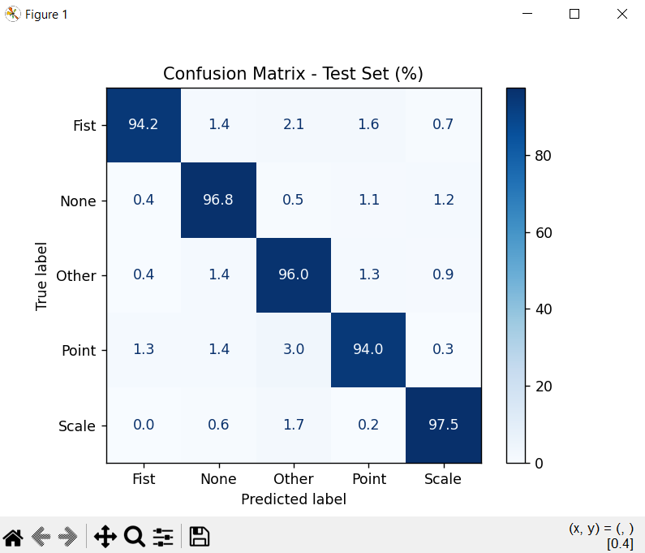

# Hand Gesture Control using Computer Vision

This project implements a system for gesture-based control of the Windows operating system using computer vision. Users can control system volume and manipulate the mouse cursor using simple hand gestures.
## 🛠️  Technologies

- **Python:** The primary programming language used for the development of the entire system.

- **TensorFlow / Keras:** Used for building, training, and executing the Convolutional Neural Network (CNN) model, including image preprocessing pipelines (resizing, normalization, and augmentation).

- **OpenCV:** Used for image processing, real-time video capture, and preparing input data for the model.

- **MediaPipe Hands:** Utilized for hand detection and extracting the ROI from the video feed, providing the geometric coordinates needed for mouse and volume control

- **NumPy:** Essential for handling numerical data and performing operations on image matrices.

- **PyAutoGUI:** Used for programmatic control of the mouse cursor.

- **Pycaw:** Used to interface with the Windows Core Audio APIs to control system volume.

- **Matplotlib / Pyplot:** Employed for visualizing training results, including loss/accuracy plots and evaluation charts.

- **Scikit-learn:** Used for model evaluation, providing metrics such as confusion matrices and classification reports.

## 📸 Gesture demo 

The system processes a continuous video stream in real-time, integrating computer vision with a deep learning classifier:

1. **Preprocessing:** The application detects the hand using MediaPipe, extracts the Region of Interest (ROI), and performs essential format conversion. This includes converting the color format from BGR (OpenCV default) to RGB, followed by normalization to a (64x64) format suitable for the model.
2. **Classification:** The processed image is fed into the trained CNN model, which outputs probability scores for predefined gestures.
3. **Control Logic:** A state-machine approach ensures robust and stable interaction:

<div align="center">

| Gesture | Function | Description | Visual |
| :---: | :---: | :---: | :---: |
| **Point** | Mouse Movement | Triggers cursor movement by tracking the palm center and enables "Fist" gesture detection as an edge-triggered click. |  |
| **Fist** | Mouse Click | Recognizing a clenched fist triggers a click |  |
| **Scale** | Volume Control | Activates volume control by dynamically mapping the Euclidean distance between thumb and index finger tips. |  |

</div>

- **Stability:** The logic implements confidence thresholds and dwell timers to prevent accidental triggers or jitter, ensuring that actions like the "Fist" click are only executable when the system is in the "Point" state.
  
## 📊 Performance evaluation

To ensure high reliability, the system was evaluated on a controlled dataset. The confusion matrix below illustrates the gesture recognition accuracy.

<div align="center">
  
</div>

### Key Insights

* **Overall Accuracy:** The model achieves high precision across all classes, with an average accuracy exceeding **95%**.
* **Challenges:** The "Fist" and "Point" gestures exhibit slightly lower classification accuracy. This is primarily because these shapes frequently overlap with natural, neutral hand postures, causing the model to misclassify them as "Other." In practice, this results in occasional input lag or missed triggers during use, which is consistent with the lower confidence scores visible in the pictures above.
* **Environmental Sensitivity:** The model shows sensitivity to low-light conditions, which negatively impacts the feature extraction process and increases the likelihood of misclassification.

## 🚀 Installation and usage

To set up the project on your local machine, follow these steps:

1. **Clone the repository:**
   ```bash
   git clone https://github.com/bjukic00/Hand-Gesture-Control.git
   cd gesture-controller
2. **Install dependencies:**
   ```bash
   pip install -r requirements.txt
4. **Run the application:**
   ```bash
   python main.py

> **Important Note:** Please ensure that you execute the application **from the project root directory**. Running the script from a subfolder will result in path resolution errors for assets and models. 
> *For VS Code users, a `.vscode/settings.json` file is already included in the repository to automatically enforce running the project from the root.*

### Dataset Information

Please note that the raw dataset is **not included** in this repository due to its large size. The dataset consists of a custom collection of images, including self-captured samples, images sourced from the web, and synthetically generated data.

* **Pre-trained Model:** Although the raw dataset is not provided, the repository includes a pre-trained model located in the `models/` directory. This allows you to run the application immediately after installing the dependencies without needing to train it from scratch.
* **Retraining:** If you wish to retrain the model on your own data, ensure your dataset is organized in the following structure:


```text
dataset/
├── Fist/
├── None/
├── Other/
├── Point/
└── Scale/
```

> **Note:** The program will automatically handle image resizing and dataset splitting upon execution. However, you can also use `resize_images.py` and `data_split.py` to perform these operations in advance, which will significantly speed up the training process.

## 💡 Planned improvements
* [ ] **Dataset Expansion:** Incorporate a larger volume of images featuring diverse lighting conditions to improve model robustness.
* [ ] **Background Complexity Module:** Develop a module to analyze and handle complex or cluttered backgrounds during inference.
* [ ] **Dynamic Gesture Recognition:** Implement support for dynamic hand gestures, moving beyond static posture recognition.

## Thesis documentation
This project was developed as part of my thesis at FESB, University of Split. You can view or download the full document here: [Download Thesis PDF](assets/DiplomskiRad_BornaJukic.pdf)
