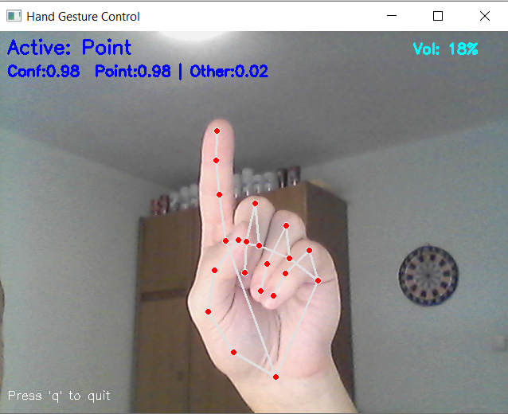
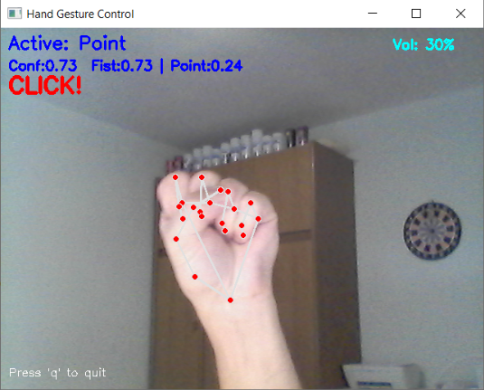
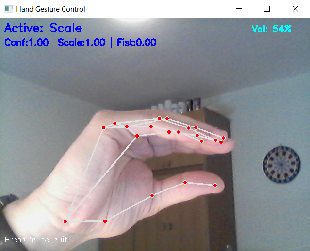

# Hand Gesture Control using Computer Vision

This project implements a system for gesture-based control of the Windows operating system using computer vision. Users can control system volume and manipulate the mouse cursor using simple hand gestures.
## 🛠 Technologies

- **Python:** The primary programming language used for the development of the entire system.

- **TensorFlow / Keras:** Used for building, training, and executing the Convolutional Neural Network (CNN) model, including image preprocessing pipelines (resizing, normalization, and augmentation).

- **OpenCV:** Used for image processing, real-time video capture, and preparing input data for the model.

- **MediaPipe Hands:** Utilized for hand detection and extracting the ROI from the video feed, providing the geometric coordinates needed for mouse and volume control

- **NumPy:** Essential for handling numerical data and performing operations on image matrices.

- **PyAutoGUI:** Used for programmatic control of the mouse cursor.

- **Pycaw:** Used to interface with the Windows Core Audio APIs to control system volume.

- **Matplotlib / Pyplot:** Employed for visualizing training results, including loss/accuracy plots and evaluation charts.

- **Scikit-learn:** Used for model evaluation, providing metrics such as confusion matrices, classification reports, and utilities for dataset splitting.

## 📸 Gesture demo 

&nbsp;
| Gesture | Funkction | Description | Visual |
| :---: | :--- | :--- | :--- |
| **Point** | Mouse Movement | Moving the index finger controls the cursor |  |
| **Fist** | Mouse Click | Recognizing a clenched fist triggers a click |  |
| **Scale** | Volume Control | Distance between fingers adjusts volume |  |

## 📊 Performance evaluation

To ensure high reliability, the system was evaluated on a controlled dataset. The dataset consists of a custom collection of images, including self-captured samples, images sourced from the web, and synthetically generated data. The confusion matrix below illustrates the gesture recognition accuracy.

